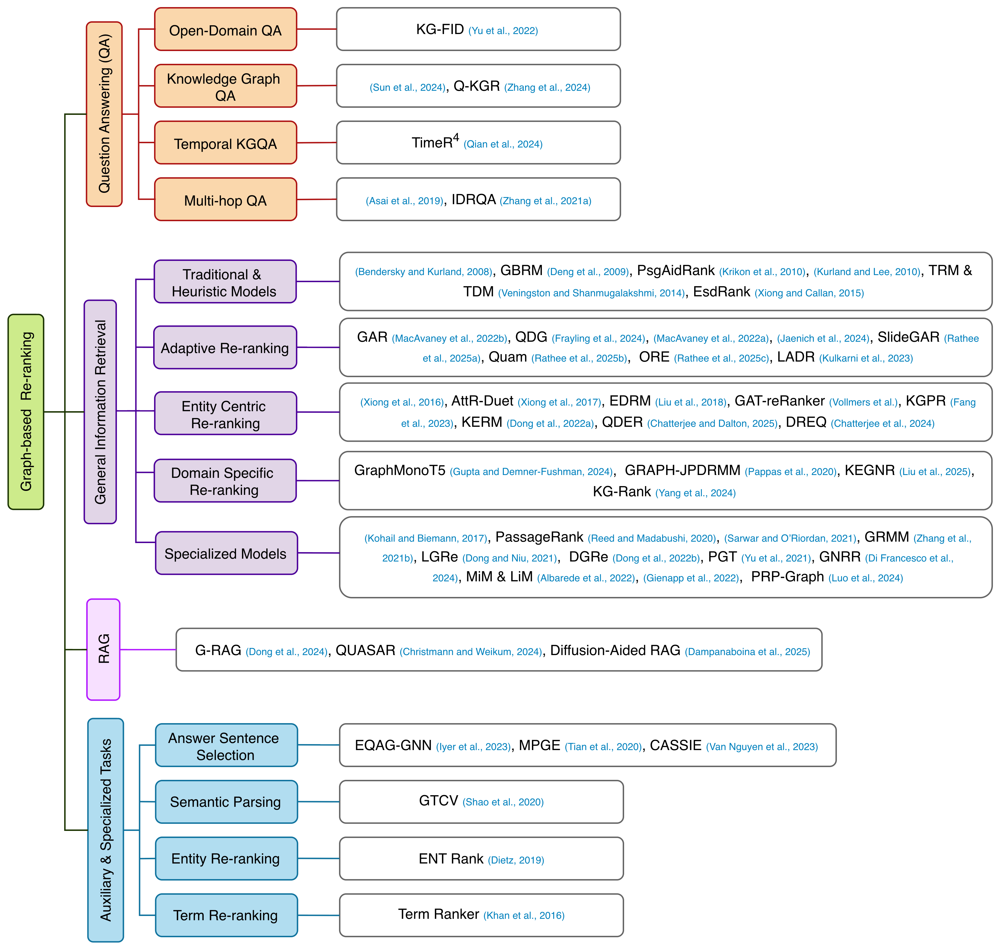
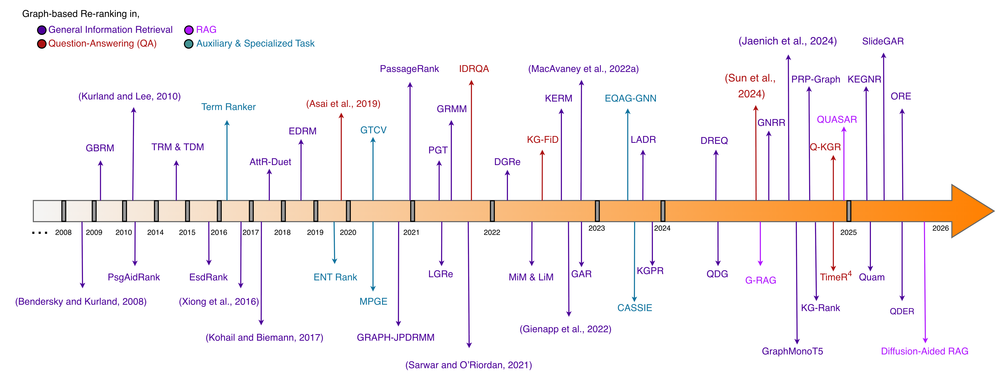

# Awesome-Graph-Reranking-IR
A curated list of papers on graph-based re-ranking methods in IR and Beyond

## 🔥 NEWS
* Coming Soon: Release of **V2**
* 03.19.2025: Release of **V1** of the survey on [arXiv](https://arxiv.org/abs/2503.14802)

## 🚀 Related Work from Our Group
[Density2R](https://ieeexplore.ieee.org/document/11401587), an efficient zero-shot document re-ranking method for information retrieval, RAG, and LLM-based reranking, published at IEEE BigData 2025.
> It is a lightweight zero-shot document re-ranking method that uses embedding density over LLM parametric knowledge to reduce token cost and latency for RAG and information retrieval pipelines.
🔗 GitHub: [Density2R_GitHub](https://github.com/Shahir47/Density2R)

## 📝 ABSTRACT
(**V2**) The two-stage information retrieval (IR) framework, also known as the retrieve-then-re-rank pipeline, has empowered numerous AI paradigms, including retrieval-augmented generation (RAG) and question-answering (QA) systems that leverage ad hoc knowledge to address the rapidly expanding information landscape. In this setting, graph structures have emerged as a promising mechanism for context augmentation, further enhancing re-ranking frameworks through structured relational modeling, semantic dependency representation, and adaptive retrieval strategies. Consequently, graph representation learning techniques have been actively explored alongside leading IR paradigms. Despite increased research interest in graph-based re-ranking methods, a comprehensive study that connects existing approaches and provides a clear overview of this paradigm remains absent. In this survey, we provide an in-depth review of graph-based re-ranking models, tracing their history, evolution, and state-of-the-art development. To facilitate a clear understanding of this paradigm, we introduce an intuitive taxonomy that organizes graph-based re-ranking models by application domain and methodological characteristics. We also present a chronological timeline that illustrates the evolution of graph-based re-ranking methods. In addition, we analyze the experimental setups of representative studies and provide detailed insight into their findings. We conclude by providing recommendations on future research based on community-wide challenges and opportunities.

## 🌳 TAXONOMY


## 🧭 TIMELINE


## ⭐ CITATION
If you find this work helpful in your research, please consider citing our work.
```
@article{zaoad2025graph,
  title={Graph-based re-ranking: Emerging techniques, limitations, and opportunities},
  author={Zaoad, Md Shahir and Zawad, Niamat and Ranade, Priyanka and Krogman, Richard and Khan, Latifur and Holt, James},
  journal={arXiv preprint arXiv:2503.14802},
  year={2025}
}
```
